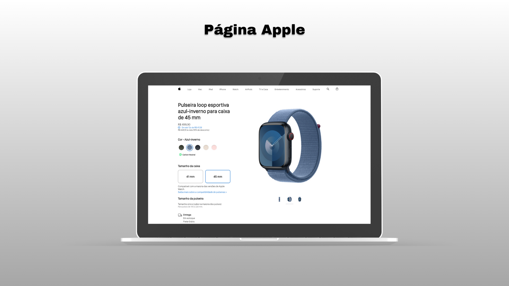

# Projeto Página Apple




## Índice
- [Sobre o projeto](#sobre-o-projeto)
- [Funcionalidades](#funcionalidades)
- [Tecnologias utilizadas](#tecnologias-utilizadas)
- [Clonar repositório](#clonar-repositório)
- [Protótipo](#protótipo)

## Sobre o projeto
Este projeto é inspirado no site da Apple, voltado para a exposição da pulseira loop esportiva para o Apple Watch. Baseado em seu design elegante, o site oferece uma interface intuitiva que destaca as opções de cores, tamanhos e características do produto.

## Funcionalidades
- Escolher entre as diferentes cores e tamanhos do produto
- Links funcionais que direcionam a página oficial da Apple
- Exibir informações sobre as cores, tamanhos, compatibilidade, preço e detalhes de venda

## Tecnologias Utilizadas
- **HTML5**: Estrutura do projeto
- **CSS3**: Estilização da interface
- **JavaScript**: Funcionalidades interativas e manipulação do DOM

## Clonar repositório
Você também pode clonar este repositório para sua máquina local:
   ```bash
   git clone https://github.com/lePerez2104/projeto-pagina_Apple.git
   ```

## Protótipo
Acesse o protótipo do projeto e experimente você mesmo:
<br>
https://projeto-pagina-apple.vercel.app/
